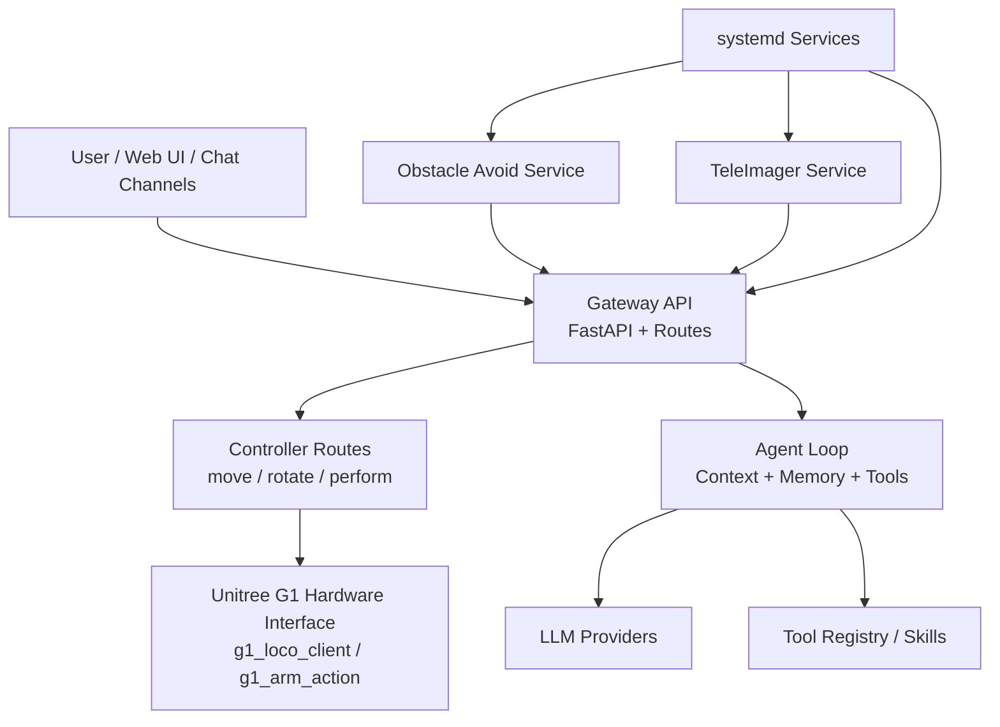

# RoboClaw

RoboClaw 是一个面向机器人场景的轻量级智能控制项目，基于 `nanobot` 框架扩展而来，聚焦于机器人网关、动作控制、技能调用与多通道 AI 交互能力。当前仓库已经集成了面向 Unitree G1 的网关接口、动作控制、图像服务与避障服务，可作为机器人 AI 应用的基础工程。

它的核心目标包括：

- 通过统一的 Gateway API 暴露机器人控制能力
- 通过 Agent Loop 连接大模型、工具调用与技能系统
- 支持将机器人能力接入 Web UI、聊天渠道与自动化流程
- 支持与机器人侧服务协同运行，例如 `teleimager` 与 `obstacle_avoid`

## 视频演示

http://120.92.138.117:50010/roboclaw/nanobot/-/raw/3f105a7db921799865b7d8e3dd6852e465b360c1/media/intro.mp4

## 项目结构

- `nanobot/agent`：Agent 主循环、上下文、记忆与工具系统
- `nanobot/gateway`：FastAPI 网关、Web UI、机器人控制路由
- `nanobot/channels`：消息渠道接入层
- `nanobot/providers`：大模型提供方适配层
- `robot/teleimager`：机器人图像采集与图传服务
- `robot/obstacle_avoid`：避障服务
- `systemd/`：部署到机器人设备时使用的服务定义
- `scripts/setup/unitree_g1.sh`：面向 Unitree G1 的一键部署脚本

## Setup

本项目推荐使用 [`uv`](https://github.com/astral-sh/uv) 进行环境管理与依赖安装。

### 1. 安装 uv

```bash
curl -LsSf https://astral.sh/uv/install.sh | sh
```

安装完成后，重新加载 shell，或手动将 `~/.local/bin` 加入 `PATH`。

### 2. 克隆项目

```bash
git clone https://github.com/spin-matrix/roboclaw.git
cd roboclaw
```

### 3. 安装 Python 与项目依赖

```bash
uv python install
uv sync
```

如果你还需要开发依赖、图像服务或避障服务，可以继续执行：

```bash
uv sync --extra dev
(cd robot/teleimager && uv sync --extra server)
(cd robot/obstacle_avoid && uv sync)
```

### 4. 初始化配置

首次启动前，需要先执行：

```bash
uv run nanobot onboard
```

请编辑配置文件 `~/.nanobot/config.json`。

通常只需要配置以下两个部分，其余选项大多已有默认值。

设置 API Key（例如 `OpenRouter`，更推荐全球用户使用）：
```json
{
  "providers": {
    "openrouter": {
      "apiKey": "sk-or-v1-xxx"
    }
  }
}
```

设置模型（也可以显式指定 provider，不指定时默认自动识别）：
```json
{
  "agents": {
    "defaults": {
      "model": "anthropic/claude-opus-4-5",
      "provider": "openrouter"
    }
  }
}
```

### 5. 启动项目

启动网关服务：

```bash
uv run nanobot gateway
```

如果需要本地命令行交互，也可以运行：

```bash
uv run nanobot agent
```

### 6. 在 Unitree G1 上部署

仓库中已经提供自动化部署脚本：

```bash
sh scripts/setup/unitree_g1.sh
```

该脚本会自动完成以下工作：

- 安装系统依赖
- 安装 `uv`
- 拉取或更新 `roboclaw` 仓库
- 同步主项目、`teleimager`、`obstacle_avoid` 的依赖
- 安装并启动 `roboclaw.service`、`teleimager.service`、`obstacle-avoid.service`

## 系统架构图



## 运行说明

- `nanobot gateway` 提供机器人控制与前端入口
- `controller` 路由负责速度、移动、旋转、动作等控制接口
- `unitree_g1.py` 负责将控制命令映射到机器人底层 CLI
- `teleimager` 提供机器人图像输入能力
- `obstacle_avoid` 通过安全状态控制前进动作是否允许执行

## 致谢

本项目基于 [nanobot](https://github.com/HKUDS/nanobot) 开发，在其轻量级 AI Agent 框架基础上扩展了机器人网关与硬件控制能力。感谢 `nanobot` 项目及其贡献者提供的基础能力与设计灵感。
